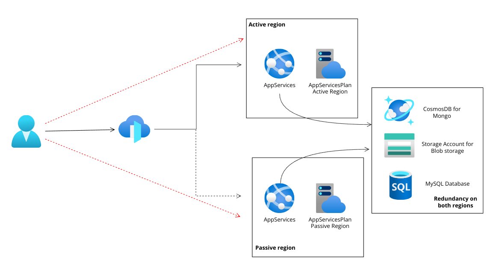

# SDGD Infrastructure as code

## Table of Contents


- [SDGD Infrastructure as code](#sdgd-infrastructure-as-code)
  - [Table of Contents](#table-of-contents)
  - [About ](#about-)
  - [Getting Started ](#getting-started-)
    - [Prerequisites](#prerequisites)
    - [Running the script](#running-the-script)

## About <a name = "about"></a>

This is an infrastructure as code implementation for the sdgd project made using terraform. With the provided script we provision an active-passive infrastructure on Azure.


## Getting Started <a name = "getting_started"></a>

### Prerequisites

You need following in order to be able to run the script:
- Azure subscription
- Azure cli
- Terraform


### Running the script

After checking the list of prerequisites and having a copy of the repository on your machine, make sure to put your tenant id and subscription id in the  <code>provider.tf</code> file.
after that execute the following commands to run the script:


Installing the azurerm requirements
```
terraform init --upgrade
```

Terraforms validates syntax
```
terraform validate
```

Lists out the changes to be made
```
terraform plan
```

Applies the changes
```
terraform apply
```
